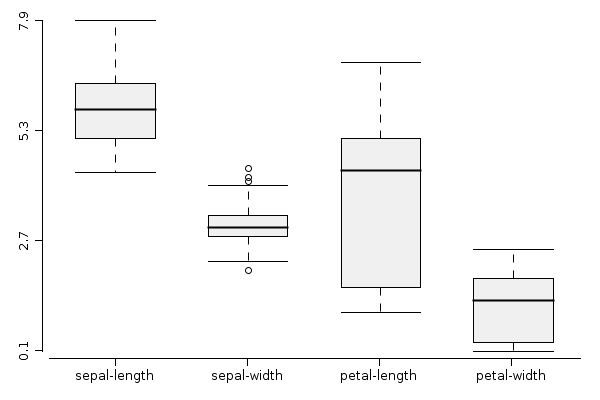
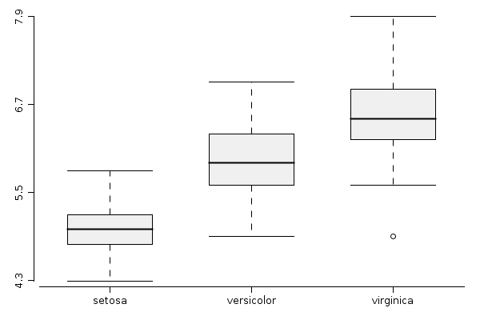

## Introduction into data visualization using rapaio library

The purpose of this document is not to exhaust the graphics features of the library
and graphics components which are already built in. There are good reasons why such a
goal would be inappropriate:

* the library it's still in working phase, even there are many components ready for
production use; any careful enumeration would be incomplete as soon as another
graphical features would be added
* stressing the whole features even for a single component would be time consuming since
working with all the combinations of graphical aspect options would take too much space
to time for everybody

The goal of this document is to illustrate the core ideas behind the graphic system
and to provide enough examples to have a fast and productive feedback.

The design of the graphical components of this library is influenced by many ideas
from existing popular graphical systems. Among the main inspirations there are
 some which deserves appropriate consideration: `R` standard graphical library,
 `ggplot2` package  and `matplotlib` from Python stack.

## Data sets

For the purpose of this tutorial some built-in data sets are used. Most of the built
in data sets are available via `rapaio.datasets.Datasets` class. This is an utility class
which provides some standard data sets used in many statistical and machine learning text
books. There are a few which we will use for the purpose of this tutorial.

### Iris data set

The **Iris flower data set** or **Fisher's Iris data set** is a multivariate data set
introduced by Ronald Fisher in his 1936 paper *The use of multiple measurements in
taxonomic problems as an example of linear discriminant analysis*. It is sometimes
called **Anderson's Iris data** set because Edgar Anderson collected the data to
quantify the morphologic variation of Iris flowers of three related species.
Two of the three species were collected in the Gaspé Peninsula *all from the same
pasture, and picked on the same day and measured at the same time
by the same person with the same apparatus*.

The data set consists of 50 samples from each of three species of Iris
(Iris setosa, Iris virginica and Iris versicolor). Four features were measured from
each sample: the length and the width of the sepals and petals, in centimetres.
Based on the combination of these four features,
Fisher developed a linear discriminant model to distinguish the species
from each other.

    Frame iris = Datasets.loadIrisDataset();
    iris.printSummary();

This is the summary of this data set:

     > printSummary(frame, [sepal-length, sepal-width, petal-length, petal-width, class])
    rowCount: 150
    complete: 150/150
    varCount: 5
    varNames:

     0. sepal-length : NUMERIC |  2. petal-length : NUMERIC |  4. class : NOMINAL |
     1.  sepal-width : NUMERIC |  3.  petal-width : NUMERIC |

       sepal-length      sepal-width     petal-length      petal-width            class
       Min. : 4.300     Min. : 2.000     Min. : 1.000     Min. : 0.100      setosa : 50
    1st Qu. : 5.100  1st Qu. : 2.800  1st Qu. : 1.600  1st Qu. : 0.300  versicolor : 50
     Median : 5.800   Median : 3.000   Median : 4.350   Median : 1.300   virginica : 50
       Mean : 5.843     Mean : 3.057     Mean : 3.758     Mean : 1.199
    2nd Qu. : 6.400  2nd Qu. : 3.300  2nd Qu. : 5.100  2nd Qu. : 1.800
       Max. : 7.900     Max. : 4.400     Max. : 6.900     Max. : 2.500

## Box plot

A box plot is a standard way of displaying information about the distribution of
a continuous data variable based on five data summary. The five data summary consists
of: *minimum*, *first quartile*, *median* (*second quartile*), *third quartile* and
*maximum* number summaries.

Box plots might be constructed in different manners by different authors. The common
characteristics for all types of box-plots is *the box*.

Which means that in all
cases the bottom margin of the box lies on first quartile, the top margin of the box
lies on third quartile and the line inside the box lies on median values.

The extensions which comes from the box might differ and rapaio system implements the
version which it's usually named: **Tuckey's box plot**. What is specific to this
box plot is that the whiskers lies at the datum still within 1.5 IQR
(*Interquartile range*).

Any other points above or below whiskers are outliers. Outliers are of two different
types:

* *extreme outliers* - outliers which are at a distance greater or equal than 3*IQR
* *outliers* - outliers which are at a distance greater or equal than 1.5*IQR

### Example 1

**Scope**: *Draw one box plot for each numerical variable from iris data set. We
want each box plot to have a different color and we want some de-saturated colors.*

**Solution**:

    WS.draw(boxPlot(iris.mapVars("0~3"), color(1, 2, 3, 4), alpha(0.5f)))

`iris.mapVars("0~3")` obtain a data set from `iris` data set, by keeping only the
first 4 variables. We do that using the range notation (index of the start variable,
concatenation symbol `~`, index of the last variable inclusive). Pay attention that
variable indexes are 0 based.

`color(1, 2, 3, 4)` we use colors from the current color palette, indexed with the
specified integer values.

`alpha(0.3f)` we de-saturate the drawing keeping only 0.3 of the actual color.

### Example 2

**Scope**: *In order to identify the overlap between values of `sepal-length` variable
from iris data set, we draw one box plot for each segment of the nominal `class`
variable, and add a title*

**Solution**:

    WS.draw(boxPlot(iris.var("sepal-length"), iris.var("class"))
        .title("sepal-length separation"));

`iris.var("sepal-length")` is the variable named `sepal-length` from `iris` data set,
 which is the numerical variable to be segmented and later box-plotted

 `iris.var("class")` specifies the segment discriminator, depending on the levels of
 this variable, the same number of levels will be created

 `.title("..")` adds a title to the box plot

## Points (XY Scatter plot)

We can study the relation between two numerical variables by drawing one point for
each instance.

### Example 1

**Scope**: *Study which is the relation between `petal-length` and `sepal-length`
from `iris` data set.*

**Solution**:

        WS.draw(points(iris.var("petal-length"), iris.var("petal-width")));

`iris.var("petal-length")` - variable used to define horizontal axis

`iris.var("petal-width")` - variable used to define vertical axis

### Example 2

**Scope**: *Study which is the relation between `petal-length` and `sepal-length`
from `iris` data set. Color each point with a different color corresponding with
value from variable `class` and add a legend for colors.*

**Solution**:

        WS.draw(points(iris.var("petal-length"), iris.var("petal-width"),
            color(iris.var("class")), pch(2))
                .legend(1.5, 2.2, labels("setosa", "versicolor", "virginica"));

`iris.var("petal-length")` - variable used to define horizontal axis

`iris.var("petal-width")` - variable used to define vertical axis

`color(iris.var("class"))` - norminal variable which provides indexes to select colors from
current palette

`pch(2)` - select the type of figure used to draw points (in this case is a circle
filled with solid color and a black border)

`legend(1.5, 2.2, labels("setosa", "versicolor", "virginica"))` - adds a legend at the specific
position specified in the data range; labels are specified by parameter, colors are taken as
default from current palette starting with 1

